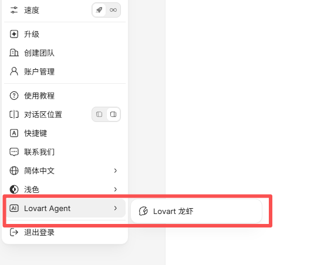
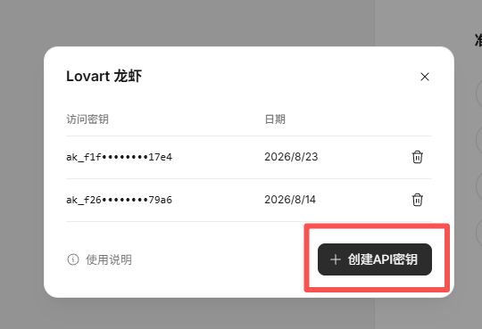
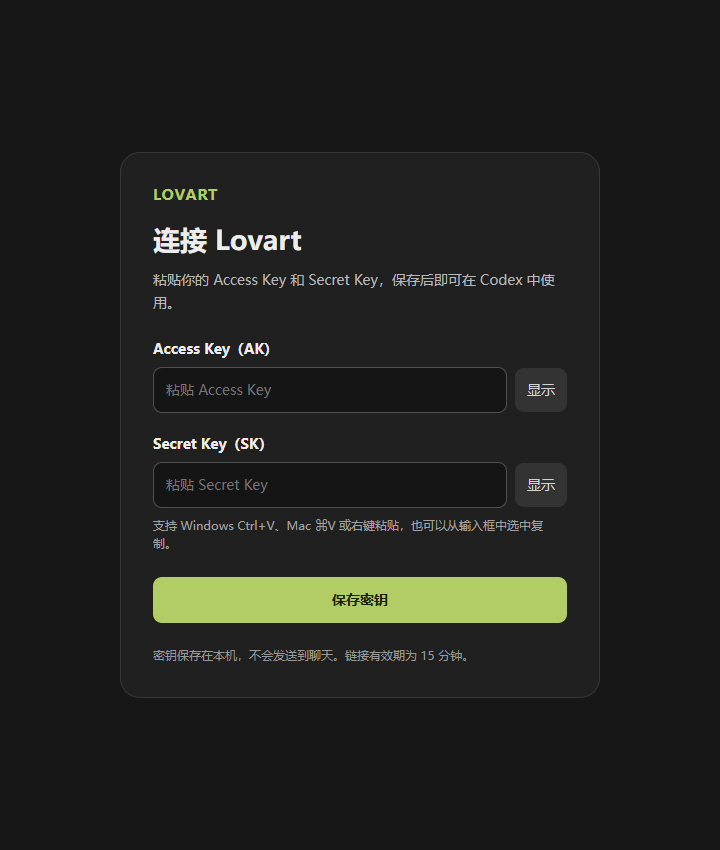

# Lovart for Codex

在 Codex 中调用 Lovart 生成和编辑图片、视频、音频与 3D 内容，并用卡片查看图片、播放视频、放大参考图、下载结果和重新生成。正常使用只需安装 **Lovart**，无需另外安装 Lovart UI Probe。

当前版本：**v0.3.0**。Windows 和 macOS 都通过本机网页填写 AK / SK，支持粘贴，保存后下次调用自动生效。

## 下载与安装

需要支持插件的 Codex、Node.js **24 或更新版本**，以及 Python **3.10 或更新版本**。插件会优先寻找 Codex 自带的 Python；没有时，Windows 使用 `py`，macOS 使用 `python3`。

### 方法一：直接从 GitHub 安装

在终端执行：

```sh
codex plugin marketplace add xiongrubing335100-beep/lovart-codex-plugin
codex plugin add lovart@lovart-codex
```

安装后在 Codex 中新建一个对话，即可使用。如果终端提示找不到 `codex` 或没有 `plugin` 子命令，请更新 Codex，或把仓库链接发给 Codex，让它协助安装插件。

### 方法二：下载安装包

| 系统 | 下载 |
| --- | --- |
| Windows | [Windows ZIP](https://github.com/xiongrubing335100-beep/lovart-codex-plugin/releases/download/v0.3.0/lovart-codex-plugin-v0.3.0-windows.zip) · [SHA-256](https://github.com/xiongrubing335100-beep/lovart-codex-plugin/releases/download/v0.3.0/lovart-codex-plugin-v0.3.0-windows.zip.sha256) |
| macOS（Apple Silicon / Intel） | [macOS ZIP](https://github.com/xiongrubing335100-beep/lovart-codex-plugin/releases/download/v0.3.0/lovart-codex-plugin-v0.3.0-macos-universal.zip) · [SHA-256](https://github.com/xiongrubing335100-beep/lovart-codex-plugin/releases/download/v0.3.0/lovart-codex-plugin-v0.3.0-macos-universal.zip.sha256) |

也可以到 [Releases 页面](https://github.com/xiongrubing335100-beep/lovart-codex-plugin/releases) 选择版本。下载对应系统的 ZIP 并解压，找到里面的 `lovart-codex-plugin` 文件夹，然后把下面第一条命令的路径替换成它的**完整路径**。

Windows PowerShell：

```powershell
codex plugin marketplace add 'C:\你的解压位置\lovart-codex-plugin'
codex plugin add lovart@lovart-codex
```

macOS 终端：

```sh
codex plugin marketplace add '/Users/你的用户名/你的解压位置/lovart-codex-plugin'
codex plugin add lovart@lovart-codex
```

添加的是解压后的目录，不是 ZIP 文件。保留该目录，安装后在 Codex 中新建对话。ZIP 已包含运行文件，不需要自行执行 `npm install` 或构建。

## 获取并配置密钥：三个步骤

### 1. 打开 Lovart 的密钥入口

登录 [Lovart](https://www.lovart.ai/)，打开账户菜单，选择 **Lovart Agent → Lovart 龙虾**。



### 2. 创建 API 密钥

在「Lovart 龙虾」面板点击 **创建 API 密钥**，按页面提示取得 **Access Key（AK）** 和 **Secret Key（SK）**，供下一步粘贴。



### 3. 在本机网页填写并保存

安装插件后，在 Codex 中直接说：

```text
配置lovart的密钥
```

Codex 会返回一个本机配置网页链接。点击链接，把 AK、SK 分别粘贴到对应输入框，点击 **保存密钥**。



支持 **Windows Ctrl+V、Mac ⌘V、右键粘贴**及显示/隐藏。保存后下次 Lovart 调用自动读取，无需再次重启 Codex；不必将密钥发到聊天中。

链接有效期为 **15 分钟**，保存成功后关闭配置服务。链接过期、重启后打不开，或需要更换密钥时，再说一次「配置lovart的密钥」获取新入口。

## 使用方法

可以用 `@Lovart` 选择插件，也可以直接说「用 Lovart……」。例如：

**生成图片，模型与提示词分开说明：**

```text
用 Lovart，使用 MJ v8.2 模型生成图片。
提示词：雨后的小镇高中，空旷的水泥路，左侧是教学楼和连廊，
右侧是树木，自然写实电影摄影，柔和阴天光。--ar 16:9
```

**编辑已有图片：**

```text
用 Lovart，把上一张图的雨景改成晴天，保留人物和构图。
```

也可以先上传参考图片，再说明要保留的人物、服装或环境。

**将图片制作成视频：**

```text
用 Lovart，把这张图生成 5 秒视频：固定镜头，微风吹动头发和树叶。
```

首次创作时，如果还没有活动项目，Codex 会协助选择或创建 Lovart 项目。需要 Lovart 确认积分的任务，会先展示费用，确认后继续。

### 结果卡片

- **提示词与标签**：卡片正文显示创作描述；模型、宽高比、像素尺寸单独显示。模型仅有请求记录时标为「请求」，不冒充实际返回模型。只有明确匹配 1K / 2K / 4K 的尺寸才展示该规格，不显示「约 1.5K」。
- **参考图与大图**：点击缩略图放大，支持切换参考图与关闭预览。
- **Edit / Animate**：把当前图片带回 Codex，再说明修改要求或运动描述。
- **Recreate**：使用保存的输入重新生成并回贴新结果；会提交新的生成任务。
- **Download**：直接触发下载或保存对话框，不需要再向 Codex 发送下载指令。
- **多张结果**：Lovart 实际返回几张，就展示对应数量的卡片；不会保证每个模型调用必然返回四张。

## 更新与常见问题

GitHub 安装方式可在终端执行：

```sh
codex plugin marketplace upgrade lovart-codex
codex plugin add lovart@lovart-codex
```

如果是 ZIP 安装，下载并解压新版，再重新添加新版解压目录。具体见 [Windows 安装说明](docs/install-windows.md) / [macOS 安装说明](docs/install-macos.md)。更新后新建对话；旧进程仍占用插件时，关闭并重开 Codex。

**密钥存在哪里？** Windows 沿用用户环境变量；macOS 使用本机当前用户的私有配置文件，目录权限 `0700`、文件权限 `0600`，不随插件目录更新而删除。macOS v0.2.0 的旧 Keychain 配置不会被删除；升级到本版后需通过网页重新填写一次。详见 [开发与存储说明](docs/development.md)。

**网页显示保存成功，是否代表密钥有效？** 代表本机保存成功；实际 Lovart 请求仍可能因密钥无效、权限或余额等原因失败。

**为什么看不到新版入口或卡片？** 确认更新的是 Lovart 插件，并在更新后新建对话；必要时重启 Codex。不要重复提交生成任务来测试是否安装成功。

## 开发

[开发、测试与发布说明](docs/development.md)。本项目基于 [Lovart 官方 Agent Skill](https://github.com/lovartai/lovart-skill)，不是 Lovart 官方维护的 Codex 插件。
